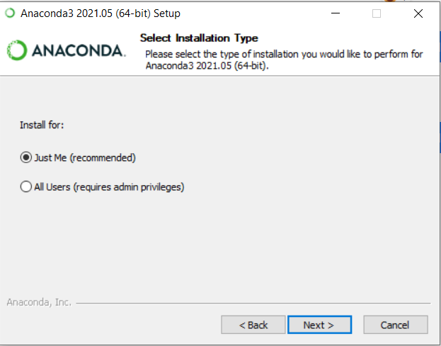
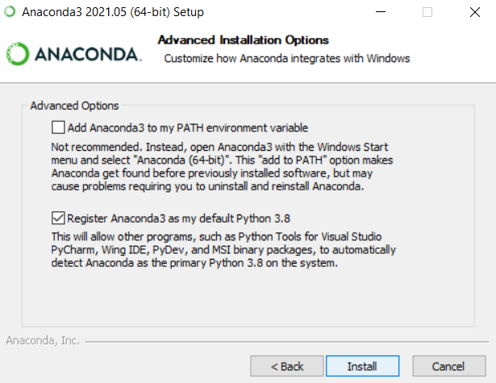
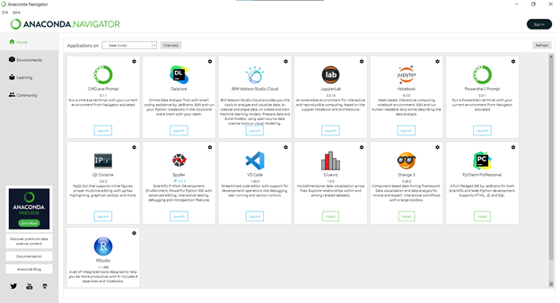
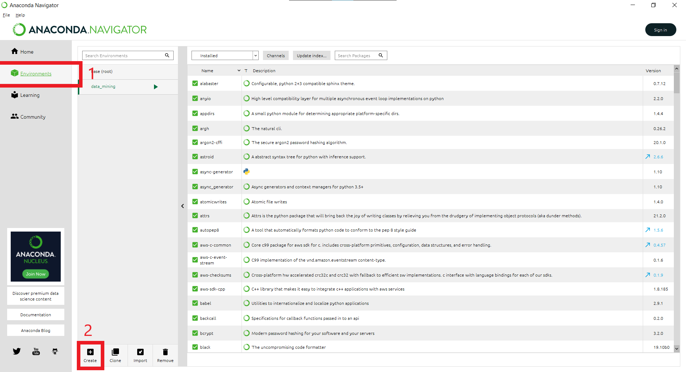
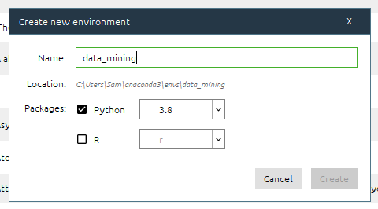
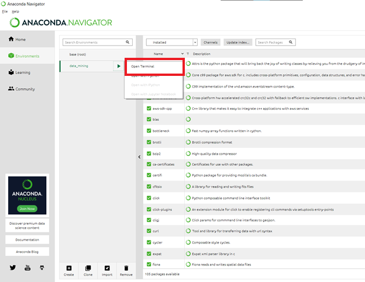
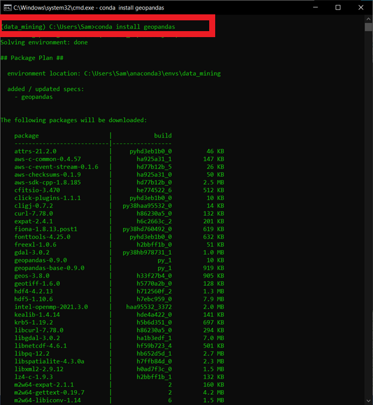
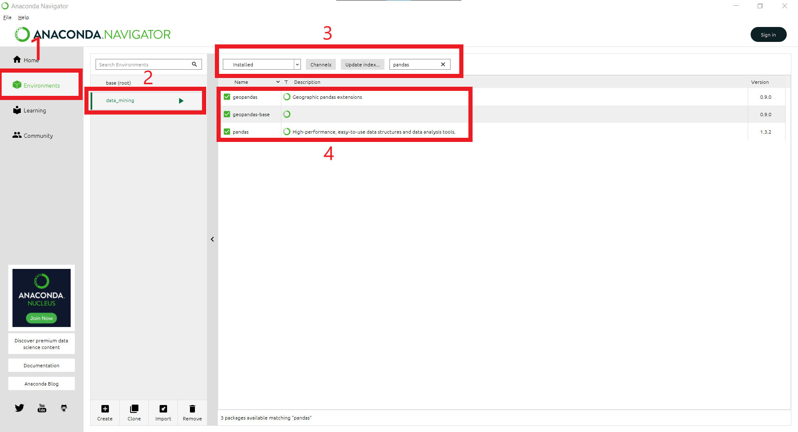
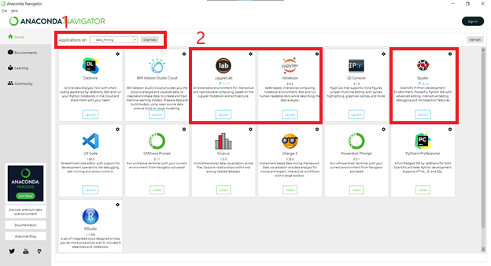
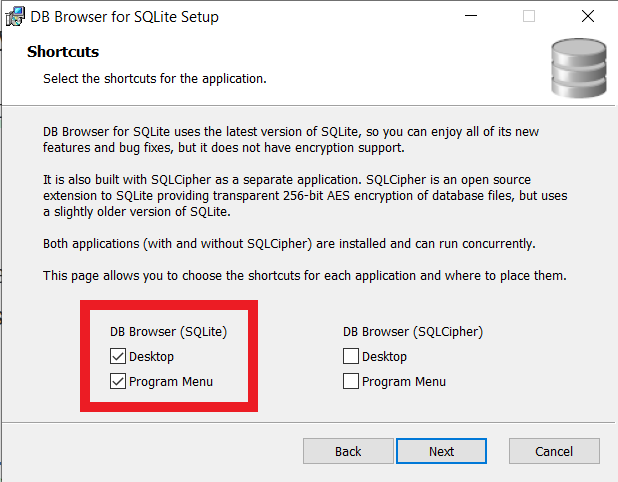

# Table of Contents
- [Table of Contents](#table-of-contents)
- [Anaconda Software](#anaconda-software)
  - [Why use Anaconda?](#why-use-anaconda)
  - [Installation Guide](#installation-guide)
  - [Installation References](#installation-references)
  - [Installation Checkpoint](#installation-checkpoint)
- [Setting Up Environment, Dependencies and Other Software](#setting-up-environment-dependencies-and-other-software)
  - [Creating Environment](#creating-environment)
  - [Setup Checkpoint](#setup-checkpoint)
  - [Setup References](#setup-references)
  - [Installing Other Software](#installing-other-software)
- [Schedule of Activities](#schedule-of-activities)
  - [Day 1](#day-1)
  - [Day 2](#day-2)
  - [Day 3](#day-3)
- [Meeting Room Information](#meeting-room-information)
- [Contact Information](#contact-information)

<div style="page-break-after: always;"></div>

# Anaconda Software

Anaconda Individual Edition contains conda and Anaconda Navigator, as well as Python and hundreds of scientific packages. When you installed Anaconda, you installed all these too.

Conda works on your command line interface such as Anaconda Prompt on Windows and terminal on macOS and Linux.

Navigator is a desktop graphical user interface that allows you to launch applications and easily manage conda packages, environments, and channels without using command-line commands.

## Why use Anaconda?
It's a "batteries included" solution especially for scientific computing, data science, etc. It includes a ton of packages that the average Python dev will never touch, but that are indispensable to people who use Python based tools not necessarily developers. Additionally, it is platform agnostic since it is available to windows, mac and linux.

## Installation Guide
**Step 1:
Download and install the [anaconda software](https://www.anaconda.com/products/individual-d) for your corresponding device**

For ease of installation, you may select the following default options upon installation




## Installation References
If you're having problems installing it out-of-the-box, you may look at the installation guide from their site.

* [Install for Windows](https://docs.anaconda.com/anaconda/install/windows/)
* [Install for MacOS](https://docs.anaconda.com/anaconda/install/mac-os/)
* [Install for Linux](https://docs.anaconda.com/anaconda/install/linux/)


<div style="page-break-after: always;"></div>

## Installation Checkpoint
To ensure that you were able to install, Anaconda Navigator must be available in your start menu / mac launchpad / apps



<div style="page-break-after: always;"></div>

# Setting Up Environment, Dependencies and Other Software


## Creating Environment

**Step 2: Open the Anaconda Navigator and select `Environments` in the sidebar**



<div style="page-break-after: always;"></div>

**Step 3: Create an environment and name it as `data_mining`**



**Step 3: Open the terminal and type in command below**

``` bash
(data_mining)$ conda install geopandas
```




## Setup Checkpoint

To ensure that you were able to install required python libraries, select the environment again and search `pandas` library in the textfield beside `Update Index`

You should be able to see both `pandas` and `geopandas` library in the list



## Setup References
* [Install Geopandas for Python with Anaconda](https://www.youtube.com/watch?v=nLezhLLp3oQ)

<div style="page-break-after: always;"></div>

## Installing Other Software

**Step 4: Go back to `Home` page in the sidebar, ensure that you are still using the `data_mining` environment and install the following software below if it's not yet installed**

* JupterLab
* Notebook
* Spyder



**Step 5: Install [DB Browser](https://sqlitebrowser.org/dl/). Selecting the link shows the installation setup for different devices**

Ensure that you enable shortcuts to your menu or your desktop



<div style="page-break-after: always;"></div>

# Schedule of Activities

## Day 1

* Setup, Intro to Python Programming
* DataTypes
* Conditional Statements

    **LUNCHBREAK**

* Functions
* Input, Output, Import
* File Handling

## Day 2

* Designing and Debugging
* Development Practices with Python

    **LUNCH BREAK**

* SQL Integration with Python
* Basic Pandas Functions

## Day 3

* Advance Pandas Functions
* Geospatial Fundamentals

    **LUNCH BREAK**
    
* Geopandas Library
* Recap and Summary

<div style="page-break-after: always;"></div>

# Meeting Room Information

Topic: Data Mining Using Python Programming

Schedule:
* Sept 16, 2021, Thursday. 8am - 5pm
* Sept 17, 2021, Friday. 8am - 5pm
* Sept 18, 2021, Saturday. 8am - 5pm

[https://up-edu.zoom.us/j/84905432910](https://up-edu.zoom.us/j/84905432910)

Meeting ID: 849 0543 2910

Passcode: ISUmining

<div style="page-break-after: always;"></div>

# Contact Information


Engr. Samantha Solis

[sam.solis@codematsing.com](mailto:sam.solis@codematsing.com)

*You may contact me if ever you have any concerns regarding the instructions mentioned*

Thank you and see you soon!
