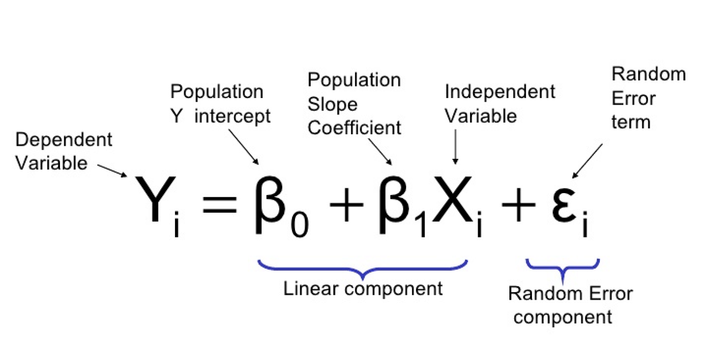

# Table of Contents
* [Introduction](#data-mining-training-session)
* [Requirements Installation](#python-installation)
* [Core Python](#what-is-python)
* [Exploratory Data Analysis](#revisit)
* [Submission Bin](#submission-instructions)

# Data Mining Training Session

## Gauging the Baseline

https://www.mentimeter.com/app
Go to menti.com


## About the session

* Learn basic python
* Introduction to python tools for data mining
* Regression Analysis

<div style="page-break-after: always;"></div>

## Python installation:

In this session, Installing an IDE (e.g. pycharm, VSCode) not mandatory while Jupyter-Notebook is more encourage for Exploratory Data Analysis

Follow the instructions below to install the bare minimum for this course

* [Install Jupyter-Notebook on Windows](https://www.youtube.com/watch?v=kf3AwEvNdno)
* [Install Jupyter-Notebook on Mac](https://www.youtube.com/watch?v=9tPS-7TWjq0)

### Links:
* [Python](https://www.python.org/downloads/)
* [Jupyter Notebook](https://jupyter.org/install)

## Online Python Notebooks:
* [JupyterLite](https://jupyterlite.readthedocs.io/en/latest/_static/lab/)
    * for basic python demo
* [Google Colaboratory](https://colab.research.google.com/#scrollTo=WpHXio_JRKsy)
    * more advance installed libraries available
    * a bit slow

<div style="page-break-after: always;"></div>

## Objectives

* Learn and apply basic and core python
* Be Introduced in python tools
* Learn and apply essential Data Science libraries used for data exploration, processing and transformation for further analysis
* Apply python for data mining applications
* Brief introduction for different data mining libraries

<div style="page-break-after: always;"></div>

### Obj: Learn and apply basic and advanced programming skills in core python

#### What is Python?
* Python is an example of a high-level language
* Low-level languages(assembly languages or machine languages) are the ones computer only understands.
* Thus, a high-level language has to be processed; taking some time.
* Advantages of a high-level language: easier to code, portability
* Low-level languages are only used for a few specialized applications.
* Kinds of program process high-level languages into low-level languages: interpreter and compiler


* Python is considered as interpreted language because Python programs are executed by an interpreter. 
* Two ways to use interpreter
  * command line
  * script mode
  * *notebook* - just command line

<div style="page-break-after: always;"></div>

#### Program
A program  is a sequence of instructions that specifies how to perform a computation. The computation might be something mathematical, such as solving a system of equations or finding the roots of a polynomial, but it can also be a symbolic computation, such as searching and replacing text in a document or (strangely enough) compiling a program.

**Terms:**
* **input**: Get data from the keyboard, a file, or some other device.
* **output**: Display data on the screen or send data to a file or other device.
* **math**: Perform basic mathematical operations like addition and multiplication.
* **conditional execution**: Check for certain conditions and execute the appropriate
sequence of statements.
* **repetition**: Perform some action repeatedly, usually with some variation.

Programming is a complex process, and because it is done by human beings, it often leads to errors. For whimsical reasons, programming errors are called bugs and the process of tracking them down and correcting them is called debugging .

#### Errors

Three kinds of errors can occur in a program:

*syntax errors* - not follow the syntax of the program

*runtime errors* - occurs once your program runs

*semantic errors* -  the program you wrote is not the program you wanted to write

#### Debugging

Experimental debugging is like detective work. You are confronted with clues, and you have to infer the processes and events that led to the results you see.

<div style="page-break-after: always;"></div>

#### Variables

One of the most powerful features of a programming language is the ability to manipulate **variables**. A variable is a name that refers to a value.

**Variable Rules**
* Variable names can be arbitrarily long. 
* They can contain both letters and numbers, but they have to begin with a letter. 
* Although it is legal to use uppercase letters, by convention we don’t. If you do, remember that case matters. `Bruce` and `bruce` are different variables.
* You include underscore character

#### Expressions

If an expression is given as a command, it is evaluated, printed and the value is lost

#### Assignments

The **assignment statement** creates new variables and gives them values:

``` python 
# variable = value
message = "What’s up, Doc?"
n = 17
pi = 3.14159
```

<div style="page-break-after: always;"></div>

#### Statements

an instruction that the Python interpreter can execute.

``` python
#%% Expressions, Assignments and Statements
print(2+1)

2+5

r=5
print(r)

s=r+10
print(s)

my_income = 1000
tax_rate=0.12
my_taxes=my_income*tax_rate
print(my_taxes)
```

<div style="page-break-after: always;"></div>

#### Operators and Operands

Operators are special symbols that represent computations like addition and multiplication. The values the operator uses are called  operands.

* addition: `+`
* subtraction: `-`
* multiplication: `*`
* division: `/`
* power: `**`
* modulo: `%`

* greater than: `>`
* greater than equal to : `>=`
* less than equal to: `<=`
* equal: `==`
* not equal: `!=`

<div style="page-break-after: always;"></div>

#### Formatted Printing

``` python
food = "pizza"

print(f'My favorite food is {food}')
```

``` python
_str = "mathematics"
_float = 0.78
_int = 78

print('In %s, we can convert %d percent as %f in decimal' % (_str, _int, _float))
print('%f can be rounded up to %.1f' % (_float, _float))
```

``` python
print('%d %d %d %d' % (1,2,3,4))

print('%s %s %s %s' % ('one', 'two', 'three', 'four'))
```

``` python
formatter = '%r %r %r %r'

print(formatter % (1,2,3,4))

print(formatter % ('one', 'two', 'three', 'four'))
```

<div style="page-break-after: always;"></div>

``` python
print('Print statements use single quotes')

print("But you can also use double quotes")

print("It's easier to use double quotes when statements have contractions or possessions")

print('And single quotes when you need to say something like "hi"')

print('But it\'s still okay to use single quotes as long as you place a backslash')

print("The same goes for double quotes(\")")
```

``` python
_str = "string"
print('I can also concat ', _str)
```

<div style="page-break-after: always;"></div>

#### Data Types

There are different kinds of datatypes in python:

* integer

``` python
x = 1
```

* float

``` python
pi = 3.14159
half = 1/2
```

* string

``` python
str1 = 'Hello'
str2 = "World"

# accessing a character
print(str1[0]) #'H'

# accessing 3rd to 4th character
print(str1[2:4]) # ll

# accessing 1st to 3rd
print(str1[:3]) # Hel

# accessing 3rd to last
print(str1[2:]) # llo

# print string twice
print(str1*2) # HelloHello

# concatenate string
print(str1+"WORLD") # HelloWORLD

# what happens?
print(str1[-1])
```
    
<div style="page-break-after: always;"></div>

* list:

``` python
hairs = ['brown', 'blond', 'red']
weights = [1,2,3,4]

#it can be heterogenous
info = ['Bob', 23, 'Male']

# accessing an element
print(hairs[1]) # 'blond'

# adding element/s
hairs.append('black')
print(hairs) #['brown', 'blond', 'red', 'black']

hairs.extend(hairs)
print(hairs) #['brown', 'blond', 'red', 'black', 'brown', 'blond', 'red', 'black']

hairs.insert(1, 'violet')
print(hairs) #['brown', 'violet', 'blond', 'red', 'black', 'brown', 'blond', 'red', 'black']

# removing element
hairs.remove('brown')
print(hairs)

# sorting
hairs.sort()
print(hairs) #['black', 'black', 'blond', 'blond', 'brown', 'red', 'red', 'violet']

hairs.reverse() 
print(hairs) #['violet', 'red', 'red', 'brown', 'blond', 'blond', 'black', 'black']
<div style="page-break-after: always;"></div>


# taking element/s
print(hairs.pop(1)) #red
print(hairs) #['violet', 'red', 'brown', 'blond', 'blond', 'black', 'black']

print(hairs.pop()) #black (last one)
print(hairs) #['violet', 'red', 'brown', 'blond', 'blond', 'black']
```
    
<div style="page-break-after: always;"></div>

* tuple
    * the same with `list` BUT it is enclosed with parentheses `()`

``` python
_tuple = ('abcd', 786 , 2.23, 'john', 70.2)
tinytuple = (123, 'john')

# Prints complete list
print(_tuple) 

# Prints first element of the list
print(_tuple[0]) 

# Prints elements starting from 2nd till 3rd
print(_tuple[1:3]) 

# Prints elements starting from 3rd element
print(_tuple[2:]) 

# Prints list two times
print(tinytuple * 2) 

# Prints concatenated lists
print(_tuple + tinytuple) 
```
* cannot be updated; no assignment operations
``` python
# try
_tuple.insert(1) 
```
    
<div style="page-break-after: always;"></div>

* dictionary
    * kind of hash table type
    * key-value pair. key can be any data type but usually numbers and strings

``` python
dictio = {}

dictio['one'] = 'This is one'
dictio[2] = 'This is two'

tinydictio = {'name': 'john', 'code':6734, 'dept': 'sales'}

print(dictio['one']) #'This is one'

print(dictio[2]) #'This is two'

# Prints complete dictionary
print(tinydictio) 

# Prints dictionary items
print(tinydictio.items())

# Prints all the keys
print(tinydictio.keys()) 

# Prints all the values
print(tinydictio.values()) 
```
    
<div style="page-break-after: always;"></div>

#### Conditional Statements

``` python
a = -1
if a > 0:
    print("positive")
elif a == 0:
    print("zero")
else:
    print("negative")
```

_spot the difference_


#### Nested Conditions

``` python
a = 0
if 2+2 == 4:
    if 2+3 == 5:
        if 2+4 == 6:
            a = a + 1
        else:
            a = a + 3
else:
    a = a + 4
# what is a?
print(a)
```

<div style="page-break-after: always;"></div>

#### Looping Statements

* For Loop

``` python
hairs = ['brown', 'blond', 'red']
for hair in hairs:
    print("Color: %s" % hair)
```

``` python
print('first loop')
x = 10
for a in range(x):
    print(a)
    # prints from 0 to x - 1
    
print('second loop')
y=20
for b in range(x,y):
    print(b)
    # prints from x to y - 1

print('third loop')
step=2
for c in range(x,y,step):
    print(c)
    # prints from x to y - 1 with step as addend
```

* While Loop

``` python
i = 0
numbers = []

while i < 6:
    print("At the top i is %d" % i)
    numbers.append(i)
    i = i + 1
    print("Numbers now: ", numbers)
    print("At the bottom i is %d:" % i)
```

<div style="page-break-after: always;"></div>

* Continue

``` python
for a in range(10):
    if a % 2 == 0:
        continue
    print(a)
```

* Break

``` python
for a in range(10)
    if a == 5:
        break
    print(a)
```

<div style="page-break-after: always;"></div>

#### Functions

``` python
def print_two(*args):
    arg1, arg2 = args
    print(args) # *args pass arguments as tuples
    print("arg1: %r, arg2: %r" % (arg1, arg2))

def print_two_again(arg1, arg2):
    print("arg1: %r, arg2: %r" % (arg1, arg2))

def print_one(arg1):
    print("arg1: %r" % arg1)

def print_none():
    print("I got nothin'.")

print_two("Bob", "Alice")
print_two_again("Bob", "Alice")
print_one("First!")
print_none()

def print_kw(**kwargs):
    print(kwargs) #**kwargs pass arguments as dictionaries

print_kw(name="Bearbrand", milk="Nay")
#{'name': 'Bearbrand', 'milk': 'Nay'}
```

#### Function Return

``` python
def add(a, b):
    return a + b

result = add(3, 4)
print(result)
```

<div style="page-break-after: always;"></div>

#### Input Method

``` python
x = input()
print(f"You've input x={x}")
y = input("Please enter a number")
print(f"You've input y={y}")

# Notice that input will always force input as...
print(type(x))
print(type(y))
```

### Input Method Scripts

* create a file `input_method.py` in our working directory

``` python

from sys import argv
script, b, c, d = argv

print(argv)
print("script: ", script)
print("second input: ", b)
print("third input: ", c)
print("fourth input: ", d)
```

<div style="page-break-after: always;"></div>

### Writing Files

* create a file `writing_files.py` in our working directory

``` python
from sys import argv
from os.path import exists

script, from_file, to_file = argv

input = open(from_file)
indata = input.read()

if not exists(to_file):
    output = open(to_file, 'w')
    output.write(indata)
    output.close()
else:
    print("already_exists")

input.close()
```

<div style="page-break-after: always;"></div>

### Exercise 1

*See [Submission Instructions](#submission-instructions)*

_Using the concepts presented in the previous secion, evaluate how to answer the following problems:_

1.  Given the side length of a triangle a = 122, b = 22, c = 120, assign to variables `area` and perimeter `s` the following computation based on the Heron's formula and print the results for the following variables.


```python
a = 122
b = 22
c = 120
#...
# Answer
s = 132
area = 1320
```

2.  Given arguments P, Y, R, calculate the monthly payments you would have to make over Y years to pay off P dollar loan at R percent interest compounded monthly. The formula is shown below:


```python
P = 122
Y = 22
R = 120
#...
# Answer
Payment = 41.98862770388198
```

3. Write a function that adds one to all even numbers on this list

``` python
x_list = [11, 6, 5, 7, 10]
# ...
print(x_list)
# 11, 7, 5, 7, 11

# hint: try running code below
value_list = ['a', 'b', 'c']
for counter, value in enumerate(value_list):
    print(counter, value)
```

4. Write a function that checks all values in list and then prints out the string relative to its value as indicated in the figure below. Note, if it touches the border, it should print "Border"


``` python
_list = [-25, 50, 25, 100]
# ...
# -25 Negative range
# 50 Border
# 25 Positive range
# 100 Out of range
```

<div style="page-break-after: always;"></div>

5. Write a program `arithmetic.py`
    * takes two inputs a, b in the command line
    * calls a function to compute sum
    * calls a function to compute difference
    * calls a function to compute product
    * calls a function to compute quotient
    * calls a function to print results of previous functions

``` python
# Test
a = 1
b = 2
#...
sum = 3
difference = -1
product = 2
quotient = 0.50
```

6. Write a program `grades.py` that prints the equivalent grade in letters.
    * \>= 90 is A
    * [80, 90) is B
    * [70, 80) is C
    * [60, 70) is D
    * < 60 is E

7. Write a program `consonants.py` 
    * reads a file via command line 
    * returns only the consonants of the file and sorted them alphabetically
    *bonus: remove repeating characters*

    * create a `test.txt` file in the working directory
    ```
    the quick brown fox jumps over the lazy dog
    ```
    
<div style="page-break-after: always;"></div>

### Obj: Learn and apply essential Data Science libraries used for data exploration, processing and transformation for further analysis

#### Revisit

Last session we introduced the core syntax of python

In the next sessions, we will using [Jupyter-Notebook](https://jupyter.org/about). If you don't have it yet, kindly revisit [Installation Steps](#python-installation)

#### Setup

1. Create a folder in your *Desktop* named **DataMiningTrainingSession**
2. Download and place the different files inside **DataMiningTrainingSession** folder (~/Desktop/DataMiningTrainingSession)
    * [Automobile Data](https://drive.google.com/file/d/1rcBU-67YtvC4q93QLW8aJP7m3XyMBkHN/view?usp=sharing)
    * [Sales Data](https://drive.google.com/file/d/19hHBV4qNfSEIxEnzWwEep_ICAbpBxPzx/view?usp=sharing)
3. After [installing Jupyter-Notebook](#python-installation), open your command prompt / terminal, change its location to the project folder (~/Desktop/DataMiningTrainingSession). You can now open a jupyter-notebook by doing the following steps:
    * [Open Jupyter-Notebook using Windows](https://www.youtube.com/watch?v=kguFtorzvxk)
    * [Open Jupyter-Notebook using Windows](https://www.youtube.com/watch?v=G1Vm6wR0XIQ)
4. Open a python3 jupyter notebook
5. Run the code the following codes below:
   *this will install the different libraries*
    
    

<div style="page-break-after: always;"></div>

#### What is Pandas?

Pandas is a Python package providing fast, flexible and expressive data structures designed to make working with relational / tabular data both easy and intuitive.

It aims to do practical, real-world data analysis in Python. Its goals is to become the **most powerful and flexible open source data analysis / manipulation tool**.

Pandas is well suited for many different kinds of data:

* Tabular data
* Ordered and unordered time-series data
* Arbitrary matrix data
* Other forms of observational / statistical data sets

#### Types of Data structures

Series - 1-dimensional

DataFrame - 2-dimensional

#### Applications of Pandas

* Handling of missing data
* Size mutability - columns can be inserted and deleted from DataFrame
* Powerful, flexible group by functionality to perform split-apply-combine operations on data sets for aggregating and transforming data
* Make it easty to convert ragged, differently-indexed data in other Python and NumPy data structures into DataFrame objects
* Intelligent label-based slicing, fancy indexing and subsetting of large data sets
* Intuitive merging and joining data sets
* Flexible reshaping and pivoting of data sets
* Hierarchical labelling of axes
* Robust IO tools for loading data from flat files
* Time series-specific functionality such as date range generation and frequency conversion, moving window statistics, date shifting and lagging

#### Why Choose Pandas?

1. Pandas is fast. It can perform multiple operations with large datasets in seconds
2. Pandas is a dependency of statsmodels, making it an important part of statistical computing ecosystem in python
3. Pandas has been used extensively in production in financial applications

<div style="page-break-after: always;"></div>

#### Exploring Pandas Functions

In the following sections try and run the following codes in Jupyter-Notebook

``` python
# Test if pandas was installed
import pandas as pd
```

``` python
# Importing Sales Data
df = pd.read_csv('sales.csv')

# if an error occurs, double check if sales.csv is inside your project folder where .ipynb is located
```

#### DataFrames

DataFrame is a collection of variables put together to share the same index
* DataFrames are the workhorse of Pandas algorithms
* Directly inspired from the R programming language
* All series objects must have the same number of elements/rows
* Must have unique column names

<div style="page-break-after: always;"></div>

#### Column Operations

* Indexing is done using the square bracket notation ([ ]). 
* Need to specify the column names.
    ```python
    df['name_of_column']
    ```
* New columns can also be created as a function of other columns using the square bracket notation ([ ]). 
    ```python
    df['new_column'] = df['old_column']
    ```
* To delete a specic column, use the drop() command and specify axis=1. Use inplace = True to make it permanent.
    ``` python
    df.drop('column_to_delete', axis =1)
    df.drop('column_to_delete’, axis =1, inplace=True)
    ```
    
***try this out***
    
```python
# viewing/selecting one column
print(df['Person'])
# viewing/selecting multiple columns
columns_to_read = ['Person','Sales']
print(df[columns_to_read])
```

```python
# creating new columns
df['SalesTax'] = df['Sales'] * df['Tax']
print(df)
```

```python
# temporary Delete
print(df.drop(['Sales', 'SalesTax'],axis=1))
print(df)
```

```python
# permanently delete column
df.drop('SalesTax',axis=1, inplace = True)
print(df)
```

<div style="page-break-after: always;"></div>

#### Row Operations

* Indexing is done using the iloc function and square bracket notation ([ ]). Need to specify the row indices.
    ```python
    df.iloc['row_numbers']
    df.iloc[['row_numbers'],['column_numbers']]
    ```
• Using labels, indexing can be done using the loc function and square brackets([ ])
    ``` python
    df.loc['row_names']
    df.loc[['row_names'],['column_names']]
    ```
• Logical indexing can be done using square brackets to select specific rows based on a logical array.
    ``` python
    df.loc['logical_column_vector']
    df.loc[condition1 & condition2 & ...]
    ```
    
***try this out***

``` python
# Df Row Ops
# reset df
df = pd.read_csv("sales.csv")

# select second row
print(df.iloc[1])
```

``` python
# select third to fourth row
print(df.iloc[2:4])
```

``` python
# create a new copy of df
df2 = df.copy()
print(df2)
```

```python
# make Person the Labels of Each Row
df2.set_index("Person", inplace = True)
print(df2)
```

```python
# Select the row for Sam
print(df.iloc[0])
print(df2.loc['Sam'])
```

```python
# Select Rows for Sam and Amy
print(df2.loc[['Sam','Amy']])
```

```python
# Select Rows for Sam and Amy and
# show only Company and Tax
print(df2.loc[['Sam','Amy'],['Company','Tax']])
```

``` python
# identify rows of where sales > 150
print(df['Sales'])
print(df['Sales'] >150)
```

```python
# select rows of df where sales >150
print(df[df['Sales'] >150])
```

``` python
# select rows of df where Sales >150 and select only columns 
#Person and Tax
print(df[df['Sales']>150][['Person', 'Tax']])
```

```python
# select rows of df where Sales >150 and select only rows 
#Company #= FB and select only columns Person and Tax
print(df[(df['Sales'] >150) & (df['Company']=='FB')][['Person','Tax']])
```

<div style="page-break-after: always;"></div>

#### Data Processing

* Data is usually not in its final form needed for most of the analytics methodologies. 
* Data in the real world is dirty
    – incomplete: lacking attribute values, lacking certain attributes of interest, or containing only aggregate data (e.g., occupation=" ")
    – noisy: containing errors or outliers (e.g., Salary="-10")
    – inconsistent: containing discrepancies in codes or names (e.g., Age=“42” Birthday=“03/07/1997”)
* Hence the need for Data Processing

#### Data Transformation

* Aggregation: summarization, data cube construction
* Melting: Conversion of short to long datasets
* Pivoting: Conversion of long datasets to short
* Generalization: concept hierarchy climbing (numeric values for age or youth, adult senior)
* Normalization: scaled to fall within a small, specified range
    - min-max normalization
    – z-score standardization
* Attribute/feature construction
    - New attributes constructed from the given ones
    
#### Data Aggregation Operations

* Aggregation functions can be applied to groups of data based on values of specific columns.
* Utilized the groupby() command
* Output is a dataframe where the following sample operations can be done by group
    * df.mean() #get mean
    * df.std() #get standard dev
    * df.min() #get min
    * df.max() #get max
    * df.count() # count the number of elements
    * df.describe() # compute for various desc. stat

<div style="page-break-after: always;"></div>

***try this out***
    
```python
#Summarizing Data
print(df.mean())
print("\n")
print(df.std())
print("\n")
print(df.min())
print("\n")
print(df.max())
print("\n")
print(df.count())
print("\n")
print(df.describe())
```

```python
# groupby aggregation
by_comp = df.groupby("Company")
print(by_comp.mean())
print("\n")
print(by_comp.std())
print("\n")
print(by_comp.min())
print("\n")
print(by_comp.max())
print("\n")
print(by_comp.count())
print("\n")
print(by_comp.describe())
```

<div style="page-break-after: always;"></div>

#### Melting

* Melting is the process of transforming measures/facts into a single column/variable 
* Melt by Mass and Velocity Example

***try this out***

``` python
print(df)
dfmelted = df.copy()
dfmelted = pd.melt(dfmelted, id_vars=['Company'], value_vars=['Sales', 'Person', 'Tax'])
print(dfmelted)
```

#### Pivoting

* Reshaped DataFrame organized by given index / column values.

***try this out***

``` python
print(df)
dfpivot = df.copy()
dfpivot = dfpivot.pivot(index='Person', columns='Company', values='Sales')
print(dfpivot)
```

<div style="page-break-after: always;"></div>

#### Merging

Just like SQL Join

***try this out***

```python
# setup dataframes for joining
df1 = pd.DataFrame({'lkey': ['foo', 'bar', 'baz', 'foo'],
                    'value': [1, 2, 3, 5]})
df2 = pd.DataFrame({'rkey': ['foo', 'bar', 'baz', 'foo'],
                    'value': [5, 6, 7, 8]})
print(df1)
print(df2)
```

```python
# merging df1 and df2 where id is df1.lkey and df2.lkey
df1.merge(df2, left_on='lkey', right_on='rkey')
```

#### Concatenating

Concatenating / appending objects along a particular axis 

***try this out***

```python
# setup dataframes for concatenating
df1 = pd.DataFrame([['a', 1], ['b', 2]],
                   columns=['letter', 'number'])
df2 = pd.DataFrame([['c', 3], ['d', 4]],
                   columns=['letter', 'number'])
print(df1)
print(df2)
```

```python
# concatenating dataframes in row axis
pd.concat([df1, df2])
```

```python
# setup for concatenating
df4 = pd.DataFrame([['bird', 'polly'], ['monkey', 'george']],
                   columns=['animal', 'name'])
print(df4)
```

```python
# concatenating dataframes in column axis
pd.concat([df1, df4], axis=1)
```

<div style="page-break-after: always;"></div>

#### Binning

* Binning: Process of transforming numerical variables into categorical counterparts. 
    - An example is to bin values for Age into categories such as 1 to 18, 18 to 49, and 49 onwards. 
* Rationale: Some Data Mining Algorithms run better on Categorical Data: e.g. Decision Trees
* Allows easy identification of outliers

**Two Types of Binning**
* Equal-width (distance) partitioning
    * Divides the range into 𝑁 intervals of equal size: uniform grid
    * if A and B are the lowest and highest values of the attribute, the width of intervals will be: 𝑊 = (𝐵 – 𝐴)/𝑁.
    * The most straightforward, but outliers may dominate presentation
    * Skewed data is not handled well
* Equal-depth (frequency) partitioning
    * Divides the range into N intervals, each containing approximately same number of samples
    * Good data scaling and outliers
    
***try this out***

``` python
# Equal Width Binning
import numpy as np
df = pd.read_csv("sales.csv") #reset df
dfbinned = df.copy()
bin_labels_3 = ['Low', 'Medium', 'High']
cutbins = np.arange(0,4,1)/3*(df['Tax'].max() - df['Tax'].min())+df['Tax'].min()
print(cutbins)
dfbinned['TaxDiscrete'] = pd.cut(df['Tax'], bins=cutbins, labels=bin_labels_3)
dfbinned=dfbinned.fillna(value="Low")
print(dfbinned)
```

```python
# Equal Depth Binning
dfbinned = df.copy()
bin_labels_3 = ['Low', 'Medium', 'High']
dfbinned['SalesDiscrete'] = pd.qcut(df['Sales'], q=3, labels=bin_labels_3)
print(dfbinned)
```

<div style="page-break-after: always;"></div>

#### Data Encoding

* Encoding or continuation is the transformation of categorical variables to binary or numerical counterparts. 
    * An example is to treat male or female for gender as 1 or 0. 
* Some Data Mining Methodologies require all data to be 
numerical, e.g. Linear Regression
* Sometimes called Dummy Variables
* Two Types
    * Binary Encoding (Unsupervised) 
    * Class-based Encoding (Supervised)
    
***try this out***

``` python
df = pd.read_csv("sales.csv") #reset df
dfencoding = df.copy()
df['Company'].unique()
dummies = pd.get_dummies(dfencoding['Company'], prefix='Company')
dfencoding = pd.concat([dfencoding,dummies], axis=1)
print(dfencoding)
```

<div style="page-break-after: always;"></div>

#### Missing Data

* Data is not always available
    - E.g., many tuples have no recorded value for several attributes, such as 
customer income in sales data
* Missing data may be due to 
    - equipment malfunction
    - inconsistent with other recorded data and thus deleted
    - data not entered due to misunderstanding
    - data may not be considered important at the time of entry
    - not register history or changes of the data
* Missing data may need to be inferred.

**Handling Missing Data**
* Ignore the tuple: usually done when class label is missing (assuming the tasks in classification—not effective when the percentage of missing values per attribute varies considerably.)
* Fill in the missing value manually: tedious + infeasible?
* Data Imputation
    - Fill in it automatically with
* a global constant : e.g., “unknown”, a new class?
* the attribute mean
* the attribute mean for all samples belonging to the same class: 
smarter

***try this out***

```python
# Setting up dataframe for missing data handling
import numpy as np #dependent library
df = pd.DataFrame([[np.nan, 2, np.nan, 0],
                   [3, 4, np.nan, 1],
                   [np.nan, np.nan, np.nan, np.nan],
                   [np.nan, 3, np.nan, 4]],
                  columns=list("ABCD"))
print(df)
```

```python
# Filling missing data
df.fillna(0)
```

<div style="page-break-after: always;"></div>

#### Data Reduction

* Data may not be balanced. 
* E.g.: Medical Dataset with 9900 negative cases and only 100 positive cases.
* Solved by:
    - Upsampling: Randomly select tuples from minority class to 
increase samples (sometimes called Bootstrapping)
    - Downsampling: Randomly select records from majority class to decrease samples
    
**Types of Sampling**
* Simple Random Sampling
    - There is an equal probability of selecting any particular item
* Sampling without replacement
    - As each item is selected, it is removed from the population
* Sampling with replacement
    - Objects are not removed from the population as they are selected 
for the sample. 
* In sampling with replacement, the same object can be picked up more than once
* Stratified sampling
    - Split the data into several partitions; then draw random samples from each partition
    
***try this out***

```python
# simple random sampling
df = pd.read_csv('sales.csv') #reset df
dfsample = df.copy()
dfsamplesubset = dfsample.sample(n=3,replace=True, random_state=1)
print(dfsamplesubset)
```

<div style="page-break-after: always;"></div>

### Exercise 2

In this exercise, we are using Automobile Dataset for data analysis. This Dataset has different characteristics of an auto such as body-style, wheel-base, engine-type, price, mileage, horsepower, etc.

* Exercise 1: From the given dataset print the first and last five rows
* Exercise 2: Print All Toyota Cars details
* Exercise 3: Sort all cars by Price column. [See reference](https://pandas.pydata.org/pandas-docs/stable/reference/api/pandas.DataFrame.sort_values.html)
* Exercise 4: Count total cars per company. [See reference](https://pandas.pydata.org/pandas-docs/stable/reference/api/pandas.core.groupby.SeriesGroupBy.value_counts.html?highlight=value_counts#pandas.core.groupby.SeriesGroupBy.value_counts)
* Exercise 5: See all toyota cars with hatchback body style
* Exercise 6: **Set** all **toyota** cars with **hatchback** body style with mileage=90
* Exercise 7: Find the most expensive car company name
* Exercise 8: Find each company’s Higesht price car
* Exercise 9: Find the average mileage of each car making company

<div style="page-break-after: always;"></div>

# Submission Instructions

* For [Exercise 1](#exercise-1)
    1. For items 1-4, place solutions in Jupyter Notebook with filename: \<LastName\>_\<FirstInital\>_Exercise1.ipynb
        * Example: Solis_S_Execise1.ipynb
    2. For items 5-7, create the .py files for the solutions and zip them under filename: \<LastName\>_\<FirstInital\>_Exercise1.zip
        * Example: Solis_S_Execise1.zip
    3. Submit all files to [Submission Bin](https://forms.gle/8gZpzcUtyboect397)

* For [Exercise 2](#exercise-2)
    1. Place solutions in Jupyter Notebook with filename: \<LastName\>_\<FirstInital\>_Exercise2.ipynb
        * Example: Solis_S_Execise2.ipynb
    2. Submit all files to [Submission Bin](https://forms.gle/sEFXViKfMbaCiGLZ9)

### Obj: Apply python for data mining applications


<!-- DON'T FORGET TO RENAME FILENAME
AND REMOVE PLANTUML AFTER -->


<!-- DON'T FORGET TO RENAME FILENAME
AND REMOVE PLANTUML AFTER -->


<!-- DON'T FORGET TO RENAME FILENAME
AND REMOVE PLANTUML AFTER -->


#### Supervised vs. Unsupervised
* Supervised Machine Learning
  * machine learning approach that’s defined by its use of labeled datasets
  * *goal*:  predict outcome
  * *application*:  spam detection, sentiment analysis, forecasting and predictions
  * *complexity*:  calculated through R and python
  * *drawbacks*:  time-consuming to train
* Unsupervised Machine Learning
  * analyzes and clusters unlabeled data sets
  * *goal*:  get insights
  * *application*:  anomaly detection, recommendation engines,
  * *complexity*:  powerful tools for working with large amounts of data
  * *drawbacks*:  more prone to inaccurate results without human intervention to validate output

  #### Classification vs. Regression
  * Classification
    * predicting discrete class label
    * usually categorical
    * evaluated through accuracy
     
    * GUI tools: [Weka](https://www.cs.waikato.ac.nz/ml/weka/)
  * Regression
    * task of predicting continuous quantity
    * may predict discrete value BUT in form of integer quantity (1 or 0)
    * evaluated through root mean squared error
    
    * GUI tools: [Mnitab](https://www.minitab.com/en-us/products/minitab/)
    
#### Linear Regression


Linear Regression is a method to predict dependent variable (Y) based on values of independent variables (X). It can be used for the cases where we want to predict some continuous quantity




The goal of regression is to obtain the coefficient estimates that the linear model fits best to available data

##### Statistics Review
* Mean, median, mode
  * mean: average
  * median: middle value
  * mode: most frequent value


* Variance


* Deviation


* Correlation
  * measure indicating extent to which two or more variables fluctuate together
  * *correlation is not causation*
  * causation - relation between something that happens and the thing that causes it


##### Terms

* Residual
  * difference [distance] between residual ith observed response and the ith predicted response

* Residual Sum of Squares (RSS)
  * measures the level of *variance* in the error term

* Residual Standard Error
  * used to measure how well a regression model fits the dataset
  * measures the *standard deviation* of residuals in a regression model
  * the smaller the standard error, the better model fits the data

* Hypothesis Test
  * action where analyst tests an assumption regarding a parameter

* F-statistic
  * Used to decide to support or reject null hypothesis
  * Reject null hypothesis if F-value > F critical value
* P-value
  * statistical measurement used to validate hypothesis test against observed data
  * the lower the p-value, the greater the statistical significance of the observed difference
  * rule of thumb: less than 5% (0.005)
* Quality of Fit
  * quality of linear regression fit is assessed by RSE and R-squared statistics
  * RSE: average amount that the response will deviate from true regression line


  * R-Squared: percentage of response variable variation that explains the linear model; higher R-squared, the better fit
  
  
  
  The regression model on the left accounts for 38.0% of the variance while the one on the right accounts for 87.4%. The more variance that is accounted for by the regression model the closer the data points will fall to the fitted regression line. 
  
#### Data Cleaning for Machine Learning Modelling

* Data Filtering
* Aggregate Values
* Missing Value Treatment
  * in real world, data can have missing values
  * machine learning algorithms do not support missing data
  * solution:
    * remove rows with missing data
    * replace missing values with mean / median values; numerical: mean / median; categorical: mode
    * impute with zero
    * segment based imputation; need domain knowledge; i.e. location-based average rainfall
* Outlier Treatment
  * impute outliers
  * cap or floor: identify `3*P99` and `0.3*P1`
  * exponential smoothing: extrapolate curve `[P95,P99]` and `[P1, P5]`
  * sigma approach: identify outliers falling outside n standard dev away from mean
* Adjust based on Seasonality
  * calculate multiplication factor for each month


* Variable Transformation
  * Bivariate analysis - simultaneous analysis of two variables. Explores the relationship between two variables


* Replace categorical variables
  * Dummy variables - artificial variables representing categorical independent variables
  * Make a separate column for each category and take 0 or 1 value
  
* Variable Reduction
  * Variables with single unique value
  * Variables with low fill rate
  * Variables with regulatory issue (personal information)
  * Variables with no business sense
* Address Multicollinearity
  * Remove highly correlated independent variables by looking at the correlation matrix and VIF
#### Multiple Linear Regression

more than one predictor variables are used to predict the response variable


#### Reading Regression Analysis


#### Coding Exercise

Access Jupyter Notebook [here](./Linear%20Regression.ipynb)