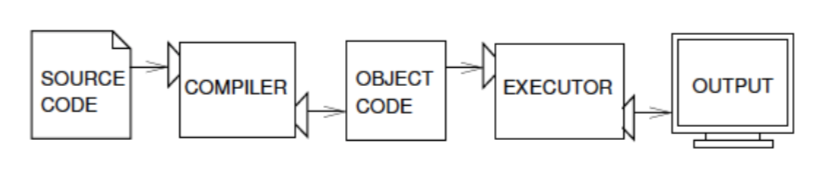
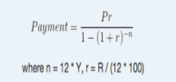

# Table of Contents
- [Table of Contents](#table-of-contents)
- [About the Facilitator](#about-the-facilitator)
- [About the session](#about-the-session)
  - [Spatial Analytics Application](#spatial-analytics-application)
    - [Telecommunications](#telecommunications)
    - [Crime Prevention](#crime-prevention)
    - [Marketing](#marketing)
    - [Crisis Response](#crisis-response)
  - [Prerequisites](#prerequisites)
- [House Rules](#house-rules)
- [Objectives](#objectives)
  - [Obj: Install, setup, and run python applications](#obj-install-setup-and-run-python-applications)
    - [Install and Setup](#install-and-setup)
    - [Run Python Applications](#run-python-applications)
  - [Obj: Learn and apply basic and advanced programming skills in core python](#obj-learn-and-apply-basic-and-advanced-programming-skills-in-core-python)
    - [What is Python?](#what-is-python)
      - [Command Line](#command-line)
      - [Script Mode](#script-mode)
  - [Program](#program)
  - [Errors](#errors)
  - [Debugging](#debugging)
  - [Variables](#variables)
  - [Expressions](#expressions)
  - [Assignments](#assignments)
  - [Statements](#statements)
  - [Operators and Operands](#operators-and-operands)
  - [Checkpoint](#checkpoint)
    - [Poll Checkpoint 1](#poll-checkpoint-1)
    - [Exercise 1](#exercise-1)
    - [Exercise 2](#exercise-2)
  - [Formatted Printing](#formatted-printing)
  - [Data Types](#data-types)
  - [Conditional Statements](#conditional-statements)
    - [Spot the difference](#spot-the-difference)
    - [Nested Conditions](#nested-conditions)
  - [Looping Statements](#looping-statements)
    - [For Loop](#for-loop)
    - [While Loop](#while-loop)
    - [Continue](#continue)
    - [Break](#break)
  - [Checkpoint 2](#checkpoint-2)
    - [Poll Checkpoint 2](#poll-checkpoint-2)
    - [Exercise 3](#exercise-3)
    - [Exercise 4](#exercise-4)
  - [Functions](#functions)
    - [Function Return](#function-return)
  - [Input Method](#input-method)
    - [Input Method Scripts](#input-method-scripts)
    - [Writing Files](#writing-files)
    - [Exercise 5](#exercise-5)
    - [Exercise 6](#exercise-6)
    - [Exercise 7](#exercise-7)

# About the Facilitator

* Background
  * BS Electronics and Communications Engineering
  * \*MS Industrial Engineering (Information Systems)
  * Licensed Electronics Engineer
* Work
    * Nokia Technology Philippines Inc.
      * Software Engineer for Base Stations
      * Scrum Master
      * Nokia Insider
      * 1st Placer IoE Hackathon
    * Big Data Project
      * Systems Developer
      * Webscraped supermarket and real estate prices
      * Analytics Platform
      * Consultant for Big Data Integration
    * DTI Inventory Management System
      * Lead Developer
      * Inventory Management System
      * Monitoring and consolidat
    * ISU ODeSSee
      * Information Systems Analyst
      * Data Trends for both Typhoon-related disasters and Covid-19 Trends
      * ETL for geospatial analysis
    * PGH Ivermectin Study
      * Project Development Officer
      * Clinical Trial Electronic Data Capture
* Others
    * *I was able to deliver these projects using only Python*
    * **Self-pledged pythonista**

# About the session

Data mining and Data Science is also known as knowledge discovery in data. While this has been a growing community and profession that attempts to uncover patterns and other valuable information from large datasets, not all types of analysis are used as frequently. 

We constantly see graphs and charts as means for statisticians and Data Scientists to communicate their findings. Geospatial Analytics is a branch of data visualization that finds trends in relationships between people and places. It adds timing and location to traditional types of data and this additional context allows for a more complete picture of events. Insights that might have been lost in a massive spreadsheet are revealed in easy-to-recognize visual patterns and images.

This training session attempts to promote the use of Geospatial analysis as another tool that aspiring Data Scientists can add to their arsenal and skillset.

## Spatial Analytics Application
[Reference](http://gis.smumn.edu/GradProjects/McGregorP.pdf)

```
There is a constant increase in cell phone subscriptions and cellular data usage across the world.

Selecting the correct placement of these towers is crucial to providing the correct 
coverage and capacity to areas that need it while optimizing spacing not waste money and 
resources.

Using Geographic Information Systems (GIS) and an accompanying Python computer 
program, existing cellular tower location data were analyzed based on proximity to nearby cities 
and roads. The results of the analysis were used to predict future tower placement with a 
weighted criteria system.
```


### Telecommunications

### Crime Prevention
[Reference](https://www.researchgate.net/publication/288955193_Spatial_Analysis_of_Factors_Responsible_for_Spread_of_Crime_Activities_in_Akure_Nigeria_Using_GIS_Techniques)

```
Responses were obtained from the administered copies of a questionnaire. 

It was found that crime hotspots are more prevalent in the city core. In view of the efficacy of GIS technique as a tool for detecting crime pattern, occurrence and prediction, the study advocates the development of all inclusive crime database system and training of security agents in the use of information technology to improve intelligence gathering capabilities in a bid to combat crimes in Akure metropolis in particular and Nigeria in general.
```


### Marketing

[Reference](https://www.esri.com/about/newsroom/arcnews/gis-tools-empower-san-franciscos-green-retrofit-campaign/?rmedium=arcnews&rsource=https://www.esri.com/esri-news/arcnews/winter1314articles/gis-tools-empower-san-franciscos-green-retrofit-campaign)

```
With the effects of climate change increasingly evident and greenhouse gas reductions, SFE needed a plan to promote a program to incentivize the city’s homeowners to invest in deep but costly energy retrofits to their homes.

Limited by budget, the department needed to allocate funds efficiently by only targeting ares that would be most receptive to the program. 

They identified that people’s demographic and lifestyle details—income, retail spending potential, utility costs, environmental and political group participation, media preferences, and spending patterns—would provide key insight.

San Francisco Department of the Enviroment identified three key segments where residents would likely consider purchasing energy upgrade packages.

The department was able to exceed its expected sales by 81 homes. 
```


### Crisis Response

*[Reference](https://theconversation.com/crowdsourced-crisis-mapping-how-it-works-and-why-it-matters-7014j)*

```
Ushahidi was developed in the wake of the disputed Kenyan elections of 2007 as a way of reporting eye-witness accounts of violence across the country. People could text the volunteers of Ushahidi, who would display the reports through Google Maps...

The explosion of user-generated content through social media can be leveraged to assist first-aid responders and humanitarian organisations in the wake of natural disasters, crises and violent conflicts...
```


## Prerequisites

We need to tackle the following:
* Learn the foundations of the tool that can be used for Spatial Analytics
* Learn the foundations of Data Mining

# House Rules

Lectures shall be provided to introduce concepts and exercises will be administered to apply what was discussed.

**This course is all about learning by doing.**

Code snippets will be projected for participants to actually type and to be able to pick up the syntax faster. Guidance will be provided for those who experience code errors so that participants can also learn how to debug errors projected in the console.

Exercises shall be projected for the participants to type and each exercise shall be given an ample time limit. Reactions in the zoom platform shall be used to monitor if the participants have successfully run the projected code snippet or not

If all participants were able to finish before the time runs out, the lecturer shall proceed to the next slide of the presentation.

If a participant signals that their code occurred an error that they cannot fix, the lecturer may request the participant to project their screen for participation in debugging the issue.

<!--trigger poll-->


* Raise hand - question / participation
* Yes - done with exercise
* No - error with exercise / need assistance
* Coffee - away
* Slow / Fast - as is

# Objectives

* Install, setup, and run python applications
* Learn and apply basic and advanced programming skills in core python
* Learn and apply essential Data Science libraries used for data exploration, processing and transformation for further analysis
* Acquire fundamental knowledge and common operations for Geospatial Analysis
* Learn and apply Python Libraries for Geospatial Analysis


## Obj: Install, setup, and run python applications

### Install and Setup

* [Setup](./Installation%20Guide.md)
* Create a folder / directory in your desktop named `DataMiningTrainingSession`

### Run Python Applications

*Spyder*

A powerful scientific environment written in Python, for Python, and designed by and for scientists, engineers and data analysts.
It offers a unique combination of the advanced editing, analysis, debugging, and profiling functionality of a comprehensive development tool

* with the data exploration, 
* interactive execution, 
* deep inspection, and 
* visualization capabilities of a scientific package.

*Working Directory*

A Working Directory is where Python will look for files, do manipulations and save results

*Cell Block*

Type the following lines of code in two cells

```python
#%% Hello World
print("Hello World")

#%% New Cell
print(1+1)
```

*Cell Block*
Run options based on the cursor location
* Run Entire File: `F5`
* Run Current Cell Block of Code: `Ctl+Enter`
* Run Current Cell Block of Code and Move to Next: `Shift+Enter`

## Obj: Learn and apply basic and advanced programming skills in core python

### What is Python?
* Python is an example of a high-level language
* Low-level languages(assembly languages or machine languages) are the ones computer only understands.
* Thus, a high-level language has to be processed; taking some time.
* Advantages of a high-level language: easier to code, portability
* Low-level languages are only used for a few specialized applications.
* Kinds of program process high-level languages into low-level languages: interpreter and compiler


* Python is considered as interpreted language because Python programs are executed by an interpreter. 
* Two ways to use interpreter
  * command line
  * script mode

#### Command Line

In spyder console:

``` python
print(1+1)
```

#### Script Mode
* Open Anaconda Navigator
* Launch CMD.exe Prompt

``` bash
(data_mining)$ cd Desktop/DataMiningTrainingSession
(data_mining)$ python session1.py
```
## Program
A program  is a sequence of instructions that specifies how to perform a computation. The computation might be something mathematical, such as solving a system of equations or finding the roots of a polynomial, but it can also be a symbolic computation, such as searching and replacing text in a document or (strangely enough) compiling a program.

**Terms:**
* **input**: Get data from the keyboard, a file, or some other device.
* **output**: Display data on the screen or send data to a file or other device.
* **math**: Perform basic mathematical operations like addition and multiplication.
* **conditional execution**: Check for certain conditions and execute the appropriate
sequence of statements.
* **repetition**: Perform some action repeatedly, usually with some variation.

Programming is a complex process, and because it is done by human beings, it
often leads to errors. For whimsical reasons, programming errors are called bugs
and the process of tracking them down and correcting them is called debugging .

## Errors

Three kinds of errors can occur in a program:

*syntax errors* - not follow the syntax of the program

*runtime errors* - occurs once your program runs

*semantic errors* -  the program you wrote is not the program you wanted to write

## Debugging

Experimental debugging is like detective work. You are confronted with clues, and you have to infer the processes and events that led to the results you see.

## Variables

One of the most powerful features of a programming language is the ability to manipulate **variables**. A variable is a name that refers to a value.

**Variable Rules**
* Variable names can be arbitrarily long. 
* They can contain both letters and numbers, but they have to begin with a letter. 
* Although it is legal to use uppercase letters, by convention we don’t. If you do, remember that case matters. `Bruce` and `bruce` are different variables.
* You include underscore character

## Expressions

If an expression is given as a command, it is evaluated, printed and the value is lost

## Assignments

The **assignment statement** creates new variables and gives them values:

``` python 
# variable = value
message = "What’s up, Doc?"
n = 17
pi = 3.14159
```

## Statements

an instruction that the Python interpreter can execute.

``` python
#%% Expressions, Assignments and Statements
print(2+1)

2+5

r=5
print(r)

s=r+10
print(s)

my_income = 1000
tax_rate=0.12
my_taxes=my_income*tax_rate
print(my_taxes)
```

## Operators and Operands

Operators are special symbols that represent computations like addition and multiplication. The values the operator uses are called  operands.

* addition: `+`
* subtraction: `-`
* multiplication: `*`
* division: `/`
* power: `**`
* modulo: `%`

* greater than: `>`
* greater than equal to : `>=`
* less than equal to: `<=`
* equal: `==`
* not equal: `!=`

## Checkpoint

### Poll Checkpoint 1

What type of error is shown below?


### Exercise 1

Given the side length of a triangle a = 122, b = 22, c = 120, assign to variables `area` and perimeter `s` the following computation based on the Heron's formula and print the results for the following variables.


```python
# Answer
s = 132
area = 1320
```

[Solution](./s1_solutions/ex1.py)


### Exercise 2

Given arguments P, Y, R, calculate the monthly payments you would have to make over Y years to pay off P dollar loan at R percent interest compounded monthly. The formula is shown below:



```python
# Answer
Payment = 41.98862770388198
```

[Solution](./s1_solutions/ex2.py)

## Formatted Printing

``` python
food = "pizza"

print(f'My favorite food is {food}')
```

``` python
_str = "mathematics"
_float = 0.78
_int = 78

print('In %s, we can convert %d percent as %f in decimal' % (_str, _int, _float))
print('%f can be rounded up to %.1f' % (_float, _float))
```

``` python
print('%d %d %d %d' % (1,2,3,4))

print('%s %s %s %s' % ('one', 'two', 'three', 'four'))
```

``` python
formatter = '%r %r %r %r'

print(formatter % (1,2,3,4))

print(formatter % ('one', 'two', 'three', 'four'))
```

``` python
print('Print statements use single quotes')

print("But you can also use double quotes")

print("It's easier to use double quotes when statements have contractions or possessions")

print('And single quotes when you need to say something like "hi"')

print('But it\'s still okay to use single quotes as long as you place a backslash')

print("The same goes for double quotes(\")")
```

``` python
_str = "string"
print('I can also concat ', _str)
```

## Data Types

There are different kinds of datatypes in python:
* integer
    ``` python
    x = 1
    ```
* float
  ``` python
  pi = 3.14159
  half = 1/2
  ```
* string
    ``` python
    str1 = 'Hello'
    str2 = "World"
    
    # accessing a character
    print(str1[0]) #'H'
    
    # accessing 3rd to 4th character
    print(str1[2:4]) # ll

    # accessing 1st to 3rd
    print(str1[:3]) # Hel

    # accessing 3rd to last
    print(str1[2:]) # llo
    
    # print string twice
    print(str1*2) # HelloHello

    # concatenate string
    print(str1+"WORLD") # HelloWORLD

    # what happens?
    print(str1[-1])
    ```
* list:
    ``` python
    hairs = ['brown', 'blond', 'red']
    weights = [1,2,3,4]
    
    #it can be heterogenous
    info = ['Bob', 23, 'Male']
    
    # accessing an element
    print(hairs[1]) # 'blond'
    
    # adding element/s
    hairs.append('black')
    print(hairs) #['brown', 'blond', 'red', 'black']

    hairs.extend(hairs)
    print(hairs) #['brown', 'blond', 'red', 'black', 'brown', 'blond', 'red', 'black']

    hairs.insert(1, 'violet')
    print(hairs) #['brown', 'violet', 'blond', 'red', 'black', 'brown', 'blond', 'red', 'black']
    
    # removing element
    hairs.remove('brown')
    print(hairs)
    
    # sorting
    hairs.sort()
    print(hairs) #['black', 'black', 'blond', 'blond', 'brown', 'red', 'red', 'violet']

    hairs.reverse() 
    print(hairs) #['violet', 'red', 'red', 'brown', 'blond', 'blond', 'black', 'black']
    
    # taking element/s
    print(hairs.pop(1)) #red
    print(hairs) #['violet', 'red', 'brown', 'blond', 'blond', 'black', 'black']

    print(hairs.pop()) #black (last one)
    print(hairs) #['violet', 'red', 'brown', 'blond', 'blond', 'black']
    ```
* tuple
  * the same with `list` BUT it is enclosed with parentheses `()`
      ``` python
      _tuple = ('abcd', 786 , 2.23, 'john', 70.2)
      tinytuple = (123, 'john')
      
      # Prints complete list
      print(_tuple) 
      
      # Prints first element of the list
      print(_tuple[0]) 
      
      # Prints elements starting from 2nd till 3rd
      print(_tuple[1:3]) 

      # Prints elements starting from 3rd element
      print(_tuple[2:]) 

      # Prints list two times
      print(tinytuple * 2) 

      # Prints concatenated lists
      print(_tuple + tinytuple) 
      ```
  * cannot be updated; no assignment operations
      ``` python
      # try
      _tuple.insert(1) 
      ```
* dictionary
  * kind of hash table type
  * key-value pair. key can be any data type but usually numbers and strings
  ``` python
  dictio = {}

  dictio['one'] = 'This is one'
  dictio[2] = 'This is two'
  
  tinydictio = {'name': 'john', 'code':6734, 'dept': 'sales'}

  print(dictio['one']) #'This is one'

  print(dictio[2]) #'This is two'

  # Prints complete dictionary
  print(tinydictio) 
  
  # Prints dictionary items
  print(tinydictio.items())

  # Prints all the keys
  print(tinydictio.keys()) 

  # Prints all the values
  print(tinydictio.values()) 
  ```

<!--Possible Lunchbreak-->
  
## Conditional Statements

``` python
a = -1
if a > 0:
    print("positive")
elif a == 0:
    print("zero")
else:
    print("negative")
```

### Spot the difference


### Nested Conditions

``` python
a = 0
if 2+2 == 4:
    if 2+3 == 5:
        if 2+4 == 6:
            a = a + 1
        else:
            a = a + 3
else:
    a = a + 4
# what is a?
print(a)
```

## Looping Statements

### For Loop

``` python
hairs = ['brown', 'blond', 'red']
for hair in hairs:
    print("Color: %s" % hair)
```

``` python
print('first loop')
x = 10
for a in range(x):
    print(a)
    # prints from 0 to x - 1
    
print('second loop')
y=20
for b in range(x,y):
    print(b)
    # prints from x to y - 1

print('third loop')
step=2
for c in range(x,y,step):
    print(c)
    # prints from x to y - 1 with step as addend
```

### While Loop

``` python
i = 0
numbers = []

while i < 6:
    print("At the top i is %d" % i)
    numbers.append(i)
    i = i + 1
    print("Numbers now: ", numbers)
    print("At the bottom i is %d:" % i)
```

### Continue

``` python
for a in range(10):
    if a % 2 == 0:
        continue
    print(a)
```

### Break
``` python
for a in range(10)
    if a == 5:
        break
    print(a)
```
  
## Checkpoint 2
  
### Poll Checkpoint 2
  
### Exercise 3

Write a program that adds one to all even numbers on this list

``` python
x_list = [11, 6, 5, 7, 10]
# ...
print(x_list)
# 11, 7, 5, 7, 11

# hint: try running code below
value_list = ['a', 'b', 'c']
for counter, value in enumerate(value_list):
    print(counter, value)
```

[Solution](ex3.py)

### Exercise 4

Write a program that checks all values in list and then prints out the string relative to its value as indicated in the figure below. Note, if it touches the border, it should print "Border"


``` python
_list = [-25, 50, 25, 100]
# ...
# -25 Negative range
# 50 Border
# 25 Positive range
# 100 Out of range
```

<!--Lunchbreak-->

[Solution](ex4.py)

## Functions

``` python
def print_two(*args):
    arg1, arg2 = args
    print(args) # *args pass arguments as tuples
    print("arg1: %r, arg2: %r" % (arg1, arg2))

def print_two_again(arg1, arg2):
    print("arg1: %r, arg2: %r" % (arg1, arg2))

def print_one(arg1):
    print("arg1: %r" % arg1)

def print_none():
    print("I got nothin'.")

print_two("Bob", "Alice")
print_two_again("Bob", "Alice")
print_one("First!")
print_none()

def print_kw(**kwargs):
    print(kwargs) #**kwargs pass arguments as dictionaries

print_kw(name="Bearbrand", milk="Nay")
#{'name': 'Bearbrand', 'milk': 'Nay'}
```

### Function Return

``` python
def add(a, b):
    return a + b

result = add(3, 4)
print(result)
```

## Input Method

``` python
x = input()
print(f"You've input x={x}")
y = input("Please enter a number")
print(f"You've input y={y}")

# Notice that input will always force input as...
print(type(x))
print(type(y))
```

### Input Method Scripts

* create a file `input_method.py` in our working directory
    ``` python

    from sys import argv
    script, b, c, d = argv

    print(argv)
    print("script: ", script)
    print("second input: ", b)
    print("third input: ", c)
    print("fourth input: ", d)
    ```
* Open anaconda command prompt

    ``` bash
    (data_mining)/path/to/DataMiningTrainingSession>python input_method.py apples oranges mangoes
    ```
    
### Writing Files

* create a file `writing_files.py` in our working directory
    ``` python
    from sys import argv
    from os.path import exists

    script, from_file, to_file = argv

    input = open(from_file)
    indata = input.read()

    if not exists(to_file):
        output = open(to_file, 'w')
        output.write(indata)
        output.close()
    else:
        print("already_exists")

    input.close()
    ```
* Open anaconda command prompt

    ``` bash
    (data_mining)/path/to/DataMiningTrainingSession>python writing_files.py input_method.py mirror.txt
    ```

### Exercise 5

Write a program `arithmetic.py`
* takes two inputs a, b in the command line
* calls a function to compute sum
* calls a function to compute difference
* calls a function to compute product
* calls a function to compute quotient
* calls a function to print results of previous functions

```python
# Test
a = 1
b = 2
#...
sum = 3
difference = -1
product = 2
quotient = 0.50
```

[Solution](./s1_solutions/arithmetic.py)

### Exercise 6

Write a program `grades.py` that prints the equivalent grade in letters.
* \>= 90 is A
* [80, 90) is B
* [70, 80) is C
* [60, 70) is D
* < 60 is E

[Solution](./s1_solutions/grades.py)

### Exercise 7

Write a program `consonants.py` 
* reads a file via command line 
* returns only the consonants of the file and sorted them alphabetically
*bonus: remove repeating characters*

* create a `test.txt` file in the working directory
```
the quick brown fox jumps over the lazy dog
```
[Solution](./s1_solutions/consonants.py)