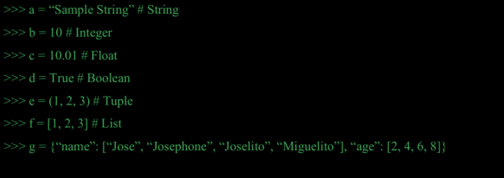
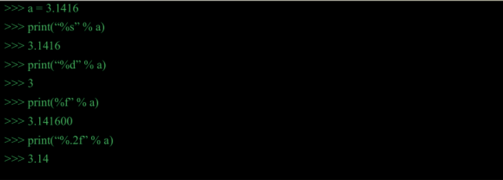
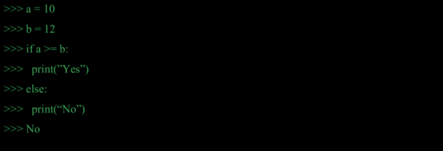
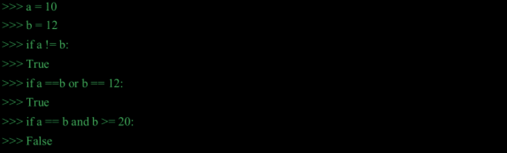
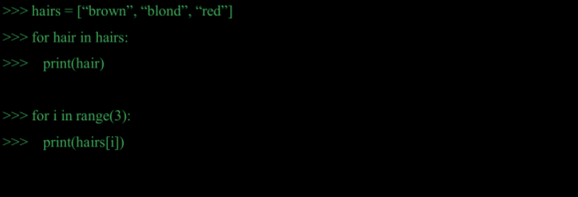
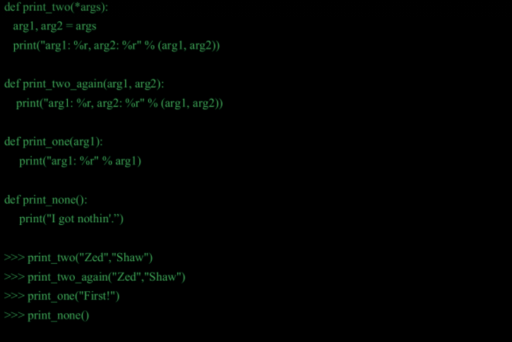
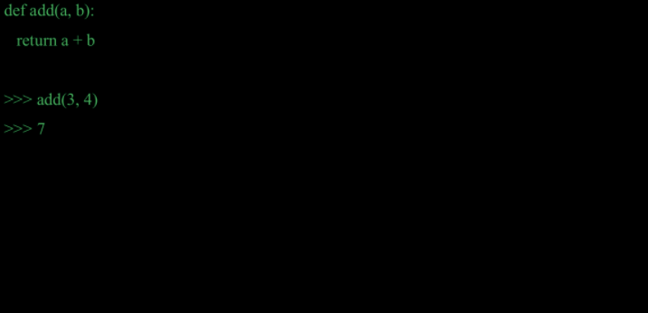
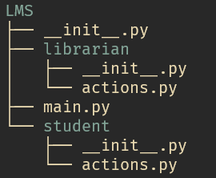
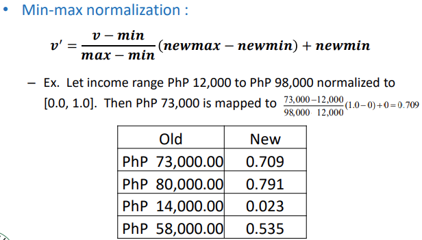
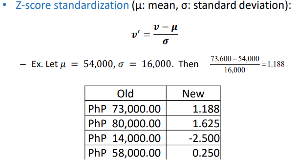

# Data Mining Training Session

# Objectives
## Obj: Learn and apply basic and advanced programming skills in core python

### Review

* Data types
    
<div style="page-break-after: always;"></div>

* Printing Variables
    
<div style="page-break-after: always;"></div>

* Inputs
    
<div style="page-break-after: always;"></div>

* Conditional Statements
    

    
<div style="page-break-after: always;"></div>

* Looping Statements
    
<div style="page-break-after: always;"></div>

* Functions
    

    
<div style="page-break-after: always;"></div>

### Designing and Debugging

#### Designing

##### Object-Oriented Programming
Python has been an **object-oriented language** since it existed. Because of this, creating and using classes and objects are downright easy. 

**Terminologies:**
* Class
  * A user-defined prototype for an object that defines a set of attributes that characterize any object of the class. The attributes are data members (class variables and instance variables) and methods, accessed via dot notation. 
* Class variable
  * A variable that is shared by all instances of a class. Class variables are defined within a class but outside any of the class's methods. Class variables are not used as frequently as instance variables are.
* Instance Variable
  * A variable that is defined inside a method and belongs only to the current instance of a class.
* Method
  * A special kind of function that is defined in a class definition.
* Inheritance
  * The transfer of the characteristics of a class to other classes that are derived from it. 
* Instantiation
  * The creation of an instance of a class.
* Instance
  * An individual object of a certain class. An object obj that belongs to a class Circle, for example, is an instance of the class Circle.
* Object
  * A unique instance of a data structure that's defined by its class. An object comprises both data members (class variables and instance variables) and methods
* Other terms:
    * Function Overloading
      * The assignment of more than one behavior to a particular function. The operation performed varies by the types of objects or arguments involved
    * Operator overloading
      * The assignment of more than one function to a particular operator.
<div style="page-break-after: always;"></div>
      
**Class structure**
``` python
class Employee:
   'Common base class for all employees'
   empCount = 0

   def __init__(self, name, salary):
      self.name = name
      self.salary = salary
      Employee.empCount += 1
   
   def displayCount(self):
     print "Total Employee %d" % Employee.empCount

   def displayEmployee(self):
      print "Name : ", self.name,  ", Salary: ", self.salary
```

**Instance Objects**
``` python
emp1.displayEmployee()
emp2.displayEmployee()
print "Total Employee %d" % Employee.empCount
```

<div style="page-break-after: always;"></div>

**Putting it all together...**
``` python
#!/usr/bin/python

class Employee:
   'Common base class for all employees'
   empCount = 0

   def __init__(self, name, salary):
      self.name = name
      self.salary = salary
      Employee.empCount += 1
   
   def displayCount(self):
     print "Total Employee %d" % Employee.empCount

   def displayEmployee(self):
      print "Name : ", self.name,  ", Salary: ", self.salary

"This would create first object of Employee class"
emp1 = Employee("Zara", 2000)
"This would create second object of Employee class"
emp2 = Employee("Manni", 5000)
emp1.displayEmployee()
emp2.displayEmployee()
print "Total Employee %d" % Employee.empCount
```

``` shell
Name :  Zara ,Salary:  2000
Name :  Manni ,Salary:  5000
Total Employee 2
```

**Adding, Removing, and Modifying Attributes**
``` python
emp1.age = 7  # Add an 'age' attribute.
emp1.age = 8  # Modify 'age' attribute.
del emp1.age  # Delete 'age' attribute.
```

**Accessing Attributes**
``` python
hasattr(emp1, 'age')    # Returns true if 'age' attribute exists
getattr(emp1, 'age')    # Returns value of 'age' attribute
setattr(emp1, 'age', 8) # Set attribute 'age' at 8
delattr(empl, 'age')    # Delete attribute 'age'
```

<div style="page-break-after: always;"></div>

**Built-In Class Attributes**
* `__dict__` − Dictionary containing the class's namespace.
* `__doc__` − Class documentation string or none, if undefined.
* `__name__` − Class name.
* `__module__` − Module name in which the class is defined. This attribute is "__main__" in interactive mode.
* `__bases__` − A possibly empty tuple containing the base classes, in the order of their occurrence in the base class list.

``` python
#!/usr/bin/python

class Employee:
   'Common base class for all employees'
   empCount = 0

   def __init__(self, name, salary):
      self.name = name
      self.salary = salary
      Employee.empCount += 1
   
   def displayCount(self):
     print "Total Employee %d" % Employee.empCount

   def displayEmployee(self):
      print "Name : ", self.name,  ", Salary: ", self.salary

print "Employee.__doc__:", Employee.__doc__
print "Employee.__name__:", Employee.__name__
print "Employee.__module__:", Employee.__module__
print "Employee.__bases__:", Employee.__bases__
print "Employee.__dict__:", Employee.__dict__
```

```
Employee.__doc__: Common base class for all employees
Employee.__name__: Employee
Employee.__module__: __main__
Employee.__bases__: ()
Employee.__dict__: {'__module__': '__main__', 'displayCount':
<function displayCount at 0xb7c84994>, 'empCount': 2, 
'displayEmployee': <function displayEmployee at 0xb7c8441c>, 
'__doc__': 'Common base class for all employees', 
'__init__': <function __init__ at 0xb7c846bc>}
```

<div style="page-break-after: always;"></div>

**Inheritance**

``` python
#!/usr/bin/python

class Parent:        # define parent class
   parentAttr = 100
   def __init__(self):
      print "Calling parent constructor"

   def parentMethod(self):
      print 'Calling parent method'

   def setAttr(self, attr):
      Parent.parentAttr = attr

   def getAttr(self):
      print "Parent attribute :", Parent.parentAttr

class Child(Parent): # define child class
   def __init__(self):
      print "Calling child constructor"

   def childMethod(self):
      print 'Calling child method'

c = Child()          # instance of child
c.childMethod()      # child calls its method
c.parentMethod()     # calls parent's method
c.setAttr(200)       # again call parent's method
c.getAttr()          # again call parent's method
```

```
Calling child constructor
Calling child method
Calling parent method
Parent attribute : 200
```

<div style="page-break-after: always;"></div>

##### Importing Concepts

* Script
  * A Python file that’s intended to be run directly. When you run it, it should do something. This means that scripts will often contain code written outside the scope of any classes or functions.
* Module
  * Python file that’s intended to be imported into scripts or other modules. It often defines members like classes, functions, and variables intended to be used in other files that import it.
* Package
  * A collection of related modules that work together to provide certain functionality. 
* Library
  * Umbrella term that loosely means “a bundle of code.” These can have tens or even hundreds of individual modules that can provide a wide range of functionality. 
  


*try it out*



``` python
# librarian/actions.py
def receive_book():
    print("Librarian: I am receiving the book")
```

``` python
# student/actions.py
def return_book():
    print("Student: I am returning the book")
```

``` python
# main.py

# you can use either method for importing
from student import actions as student_actions
from librarian import actions

student_actions.return_book()
actions.receive()
```

<div style="page-break-after: always;"></div>

#### Debugging

* Traceback
    ``` python
    def func1(a, b):
        return a / b

    def func2(x):
        a = x
        b = x - 1
        return func1(a, b)

    func2(1)
    ```
* Variables Explorer
    ``` python
    import random

    a=random.randint(1,100)
    b=random.randint(1,10)
    c=a*b

    print(c)

    # how do we know a and b without printing c?
    ```
* Debug Functionality
    ``` python
    for i in range(10):
        print("we are here but what is i?")
    ```
    
<div style="page-break-after: always;"></div>

#### Development Practices

* Using main section
    * create a file `imported_module.py`
    ``` python
    print("BOO!")
    ```
    * create a file `main.py`
    ``` python
    # scenario 1
    import imported_module
    print("AHH!")
    ```
    ``` python
    # scenario 2
    import imported_module
    if __name__ == "__main__":
        print("NOPE!")

    ```
    ``` bash
    # shell
    (data_mining)/path/to/DataMiningTrainingSession> python main.py
    ```

<div style="page-break-after: always;"></div>

* Using `with`
    ``` python
    # open a file
    file_object = open('sample.txt')
    # read the file content
    data = file_object.read()
    # print file content
    print(data)
    #close the file
    file_object.close()
    ```
    
    ``` python
    # using "with statement" with open() function
    with open('sample.txt', "r") as file_object:
    # read file content
    data = file_object.read()
    # print file contents
    print(data)
    ```

<div style="page-break-after: always;"></div>

* Exception Handling
    ``` python
    print(2/0)
    ```
    ``` python
    try:
       print(23/0)
    # Execute except block if zero division occurs
    except ZeroDivisionError:
        # handle zero division error
       print("Cannot divide by zero!")
    ```
    ``` python
    try:
       print(23/0)
    # Execute except block if zero division occurs
    except Exception as e:
        # handle zero division error
        print(e)
        print("Cannot divide by zero!")
    ```
    * Scripting vs. Analysis
      * Jupyter Notebook/Lab: for analysis
      * Text Editor (like Spyder): for writing/testing runtime scripts
    
<div style="page-break-after: always;"></div>

## Obj: Learn and apply essential Data Science libraries used for data exploration, processing and transformation for further analysis
    
### SQL Review

* Reading table
    ``` SQL
    # Get all
    SELECT * FROM sql_people #run
    SELECT * FROM sql_country #run
    # Filtered records
    SELECT * FROM sql_people WHERE country_id=2;
    # Sorting records
    SELECT * FROM sql_people ORDER BY name ASC;
    ```
* Primary Keys
    * The PRIMARY KEY constraint uniquely identifies each record in a table.
* Foreign Keys
    * A FOREIGN KEY is a field (or collection of fields) in one table, that refers to the PRIMARY KEY in another table.
* Joins
    ``` SQL
    SELECT * FROM sql_people LEFT JOIN sql_country ON sql_people.country_id=sql_country.id;
    SELECT * FROM sql_people INNER JOIN sql_country ON sql_people.country_id=sql_country.id;

    # right and outer join not supported on sqlite. But it's okay :)
    ```


<div style="page-break-after: always;"></div>

### Setup

* Open anaconda navigator and launch jupyter-notebook
* Navigate to working directory
* Create new python notebook


```python
# should be able to import all
import pandas as pd
import geopandas as gpd
import sqlite3
```


```python
ls
```

<div style="page-break-after: always;"></div>

### Pandas and SQL


```python
# sql query
conn = sqlite3.connect('db.db')

print("==show tables==")
query = "SELECT name FROM sqlite_master WHERE type='table';"
print(pd.read_sql_query(query, conn))

print("\n==storing sql table in dataframe==")
query = "SELECT * FROM sql_country"
country_df = pd.read_sql_query(query, conn)
print(country_df)
```


```python
# json file
json_df = pd.read_json("json_import.json", orient="records")
print(json_df)
```


```python
# csv file
df = pd.read_csv("sales.csv")
df
```

<div style="page-break-after: always;"></div>

### DataFrames

DataFrame is a collection of variables put together to share the same index
* DataFrames are the workhorse of Pandas algorithms
* Directly inspired from the R programming language
* All series objects must have the same number of elements/rows
* Must have unique column names

###  Column and Row Operation
**Column Operations**
* Indexing is done using the square bracket notation ([ ]). 
* Need to specify the column names.
    ```python
    df['name_of_column']
    ```
* New columns can also be created as a function of other columns using the square bracket notation ([ ]). 
    ```python
    df['new_column'] = df['old_column']
    ```
* To delete a specic column, use the drop() command and specify axis=1. Use inplace = True to make it permanent.
    ``` python
    df.drop('column_to_delete', axis =1)
    df.drop('column_to_delete’, axis =1, inplace=True)
    ```


<div style="page-break-after: always;"></div>

```python
df['Person']
# selecting multiple columns
print(df[['Person','Sales']])
```


```python
# creating new columns
df['SalesTax'] = df['Sales'] * df['Tax']
print(df)
```


```python
# temporary Delete
df.drop('SalesTax',axis=1)
print(df)
```


```python
# permanently delete column
df.drop('SalesTax',axis=1, inplace = True)
print(df)
```

<div style="page-break-after: always;"></div>

**Row Operations**

* Indexing is done using the iloc function and square bracket notation ([ ]). Need to specify the row indices.
    ```python
    df.iloc['row_numbers']
    df.iloc[['row_numbers'],['column_numbers']]
    ```
• Using labels, indexing can be done using the loc function and square brackets([ ])
    ``` python
    df.loc['row_names']
    df.loc[['row_names'],['column_names']]
    ```
• Logical indexing can be done using square brackets to select specific rows based on a logical array.
    ``` python
    df.loc['logical_column_vector']
    df.loc[condition1 & condition2 & ...]
    ```

<div style="page-break-after: always;"></div>


```python
# Df Row Ops
# reset df
df = pd.read_csv("sales.csv")

# select second row
print(df.iloc[1])
```


```python
# select third to fourth row
print(df.iloc[2:4])
```


```python
# create a new copy of df
df2 = df.copy()
print(df2)
```


```python
# make Person the Labels of Each Row
df2.set_index("Person", inplace = True)
print(df2)
```


```python
# Select the row for Sam
print(df2.loc['Sam'])
```


```python
# Select Rows for Sam and Amy
print(df2.loc[['Sam','Amy']])
```


```python
# Select Rows for Sam and Amy and
# show only Company and Tax
print(df2.loc[['Sam','Amy'],['Company','Tax']])
```


```python
# identify rows of where sales > 150
print(df['Sales'] >150)
```


```python
# select rows of df where sales >150
print(df[df['Sales'] >150])
```


```python
# select rows of df where Sales >150 and select only columns 
#Person and Tax
print(df[df['Sales']>150][['Person','Tax']])
```


```python
# select rows of df where Sales >150 and select only rows 
#Company #= FB and select only columns Person and Tax
print(df[(df['Sales'] >150) & (df['Company']=='FB')][['Person','Tax']])
```

<div style="page-break-after: always;"></div>

### Checkpoint

In this exercise, we are using Automobile Dataset for data analysis. This Dataset has different characteristics of an auto such as body-style, wheel-base, engine-type, price, mileage, horsepower, etc.

* Exercise 1: From the given dataset print the first and last five rows
* Exercise 2: Print All Toyota Cars details
* Exercise 3: Sort all cars by Price column. [See reference](https://pandas.pydata.org/pandas-docs/stable/reference/api/pandas.DataFrame.sort_values.html)
* Exercise 4: Count total cars per company. [See reference](https://pandas.pydata.org/pandas-docs/stable/reference/api/pandas.core.groupby.SeriesGroupBy.value_counts.html?highlight=value_counts#pandas.core.groupby.SeriesGroupBy.value_counts)
* Exercise 5: See all toyota cars with hatchback body style
* Exercise 6: Replace all toyota cars with hatchback body style to mileage=100

<div style="page-break-after: always;"></div>

### Data Processing
* Data is usually not in its final form needed for most of the analytics methodologies. 
* Data in the real world is dirty
    – incomplete: lacking attribute values, lacking certain attributes of interest, or containing only aggregate data (e.g., occupation=" ")
    – noisy: containing errors or outliers (e.g., Salary="-10")
    – inconsistent: containing discrepancies in codes or names (e.g., Age=“42” Birthday=“03/07/1997”)
* Hence the need for Data Processing

<div style="page-break-after: always;"></div>

#### Data Transformation
* Aggregation: summarization, data cube construction
* Melting: Conversion of short to long datasets
* Pivoting: Conversion of long datasets to short
* Generalization: concept hierarchy climbing (numeric values for age or youth, adult senior)
* Normalization: scaled to fall within a small, specified range
    - min-max normalization
    – z-score standardization
* Attribute/feature construction
    - New attributes constructed from the given ones

<div style="page-break-after: always;"></div>

#### Why Is Data Processing Important?
* No quality data, no quality mining results!
    - Quality decisions must be based on quality data (e.g., duplicate or missing data may cause incorrect or even misleading statistcs.)
    - Data warehouse needs consistent integration of quality data
    - Data extraction, cleaning, and transformation comprises the majority of the work of building a data warehouse

<div style="page-break-after: always;"></div>

**DataFrame Aggregation Operations**
* Aggregation functions can be applied to groups of data based on values of specific columns.
* Utilized the groupby() command
* Output is a dataframe where the following sample operations can be done by group
    * df.mean() #get mean
    * df.std() #get standard dev
    * df.min() #get min
    * df.max() #get max
    * df.count() # count the number of elements
    * df.describe() # compute for various desc. stat


```python
#Summarizing Data
print(df.mean())
print("\n")
print(df.std())
print("\n")
print(df.min())
print("\n")
print(df.max())
print("\n")
print(df.count())
print("\n")
print(df.describe())
```


```python
# groupby aggregation
by_comp = df.groupby("Company")
print(by_comp.mean())
print("\n")
print(by_comp.std())
print("\n")
print(by_comp.min())
print("\n")
print(by_comp.max())
print("\n")
print(by_comp.count())
print("\n")
print(by_comp.describe())
```

<div style="page-break-after: always;"></div>

**Melting**
* Melting is the process of transforming measures/facts into a single column/variable 
* Melt by Mass and Velocity Example


```python
dfmelted = df.copy()
dfmelted = pd.melt(dfmelted, id_vars=['Company'], value_vars=['Sales', 'Person', 'Tax'])
print(dfmelted)
```

**Pivoting**
* Reshaped DataFrame organized by given index / column values.


```python
dfpivot = df.copy()
dfpivot = dfpivot.pivot(index='Person', columns='Company', values='Sales')
print(dfpivot)
```

<div style="page-break-after: always;"></div>

### Data Integration (ETL)

* Data integration: 
    - Combines data from multiple sources into a coherent store
* Schema integration: e.g., A.cust-id  B.cust-#
    - Integrate metadata from different sources
* Entity identification problem: 
    - Identify real world entities from multiple data sources, e.g., Bill Clinton = William Clinton
* Detecting and resolving data value conflicts
    - For the same real world entity, attribute values from different sources are different
* Possible reasons: different representations, different scales, e.g., metric vs. British units

<div style="page-break-after: always;"></div>

**Merging**


```python
query = "SELECT * FROM sql_country"
country_df = pd.read_sql_query(query, conn)
print(country_df)

print("\n")

query = "SELECT * FROM sql_people"
people_df = pd.read_sql_query(query, conn)
print(people_df)
```


```python
pd.merge(country_df, people_df, left_on='id', right_on='country_id', how='inner')
```


```python
pd.merge(country_df, people_df, left_on='id', right_on='country_id', how='outer')
```


```python
pd.merge(country_df, people_df, left_on='id', right_on='country_id', how='left')
```


```python
pd.merge(country_df, people_df, left_on='id', right_on='country_id', how='right')
```

<div style="page-break-after: always;"></div>

**Concatenating**


```python
df1 = pd.read_csv("df1.csv")
df2 = pd.read_csv("df2.csv")
df3 = pd.read_csv("df3.csv")
print(df1)
print(df2)
print(df3)
```


```python
pd.concat([df1,df2,df3])
```


```python
pd.concat([df1,df2,df3], axis =1)
```

<div style="page-break-after: always;"></div>

**Normalization**



`


```python
dfscaled = df.copy()
dfscaled['SalesScaled'] = (df['Sales']-df['Sales'].min())/(df['Sales'].max()-df['Sales'].min())*(5-1)+1
print(dfscaled)

print("\n")

dfscaled['TaxScaled'] = (df['Tax']-df['Tax'].mean())/df['Tax'].std()
print(dfscaled)
```

**Binning**
* Binning: Process of transforming numerical variables into categorical counterparts. 
    - An example is to bin values for Age into categories such as 1 to 18, 18 to 49, and 49 onwards. 
* Rationale: Some Data Mining Algorithms run better on Categorical Data: e.g. Decision Trees
* Allows easy identification of outliers

**Two Types of Binning**
* Equal-width (distance) partitioning
    * Divides the range into 𝑁 intervals of equal size: uniform grid
    * if A and B are the lowest and highest values of the attribute, the width of intervals will be: 𝑊 = (𝐵 – 𝐴)/𝑁.
    * The most straightforward, but outliers may dominate presentation
    * Skewed data is not handled well
* Equal-depth (frequency) partitioning
    * Divides the range into N intervals, each containing approximately same number of samples
    * Good data scaling and outliers


```python
# Equal Width Binning
import numpy as np
dfbinned = df.copy()
bin_labels_3 = ['Low', 'Medium', 'High']
cutbins = np.arange(0,4,1)/3*(df['Tax'].max() - df['Tax'].min())+df['Tax'].min()
dfbinned['TaxDiscrete'] = pd.cut(df['Tax'], bins=cutbins, labels=bin_labels_3)
dfbinned=dfbinned.fillna(value="Low")
print(dfbinned)
```


```python
# Equal Depth Binning
dfbinned = df.copy()
bin_labels_3 = ['Low', 'Medium', 'High']
dfbinned['SalesDiscrete'] = pd.qcut(df['Sales'], q=3, labels=bin_labels_3)
print(dfbinned)
```

<div style="page-break-after: always;"></div>

**Data Encoding**
* Encoding or continuation is the transformation of categorical variables to binary or numerical counterparts. 
    * An example is to treat male or female for gender as 1 or 0. 
* Some Data Mining Methodologies require all data to be 
numerical, e.g. Linear Regression
* Sometimes called Dummy Variables
* Two Types
    * Binary Encoding (Unsupervised) 
    * Class-based Encoding (Supervised)


```python
dfencoding = df.copy()
dummies = pd.get_dummies(dfencoding['Company'], prefix='Company')
dfencoding = pd.concat([dfencoding,dummies], axis=1)
print(dfencoding)
```

<div style="page-break-after: always;"></div>

#### Missing Data
* Data is not always available
    - E.g., many tuples have no recorded value for several attributes, such as 
customer income in sales data
* Missing data may be due to 
    - equipment malfunction
    - inconsistent with other recorded data and thus deleted
    - data not entered due to misunderstanding
    - data may not be considered important at the time of entry
    - not register history or changes of the data
* Missing data may need to be inferred.

*Handling Missing Data*
* Ignore the tuple: usually done when class label is missing (assuming the tasks in classification—not effective when the percentage of missing values per attribute varies considerably.)
* Fill in the missing value manually: tedious + infeasible?
* Data Imputation
    - Fill in it automatically with
* a global constant : e.g., “unknown”, a new class?
* the attribute mean
* the attribute mean for all samples belonging to the same class: 
smarter

<div style="page-break-after: always;"></div>

#### Data Reduction/Manipulation

* Data may not be balanced. 
* E.g.: Medical Dataset with 9900 negative cases and only 100 positive cases.
* Solved by:
    - Upsampling: Randomly select tuples from minority class to 
increase samples (sometimes called Bootstrapping)
    - Downsampling: Randomly select records from majority class to decrease samples
    
**Types of Sampling**
* Simple Random Sampling
    - There is an equal probability of selecting any particular item
* Sampling without replacement
    - As each item is selected, it is removed from the population
* Sampling with replacement
    - Objects are not removed from the population as they are selected 
for the sample. 
* In sampling with replacement, the same object can be picked up more than once
* Stratified sampling
    - Split the data into several partitions; then draw random samples from each partition


```python
# simple random sampling
dfsample = df.copy()
dfsamplesubset = dfsample.sample(n=3,replace=True, 
random_state=1)
print(dfsamplesubset)
```

<div style="page-break-after: always;"></div>

### Checkpoint:

In this exercise, we are using Automobile Dataset for data analysis. This Dataset has different characteristics of an auto such as body-style, wheel-base, engine-type, price, mileage, horsepower, etc.

* Exercise 7: Replace all column values which contain ?, n.a, or NaN. [See Reference1](https://pandas.pydata.org/pandas-docs/stable/reference/api/pandas.DataFrame.replace.html?highlight=replace#pandas.DataFrame.replace) [See Reference2](https://pandas.pydata.org/pandas-docs/stable/reference/api/pandas.Series.fillna.html?highlight=fillna)
* Exercise 8: Find the most expensive car company name
* Exercise 9: Find each company’s Higesht price car
* Exerices 10: Find the average mileage of each car making company
* Exerices 11: Merge provinces and municipalities in database (sqlite3) and store result into a csv file. [See Reference](https://pandas.pydata.org/pandas-docs/stable/reference/api/pandas.DataFrame.to_csv.html)